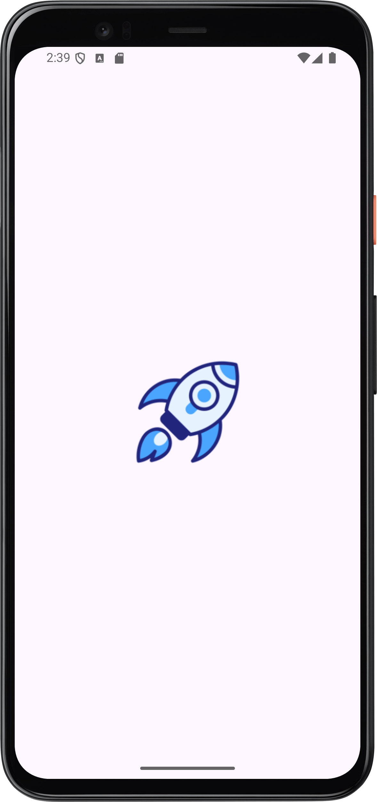
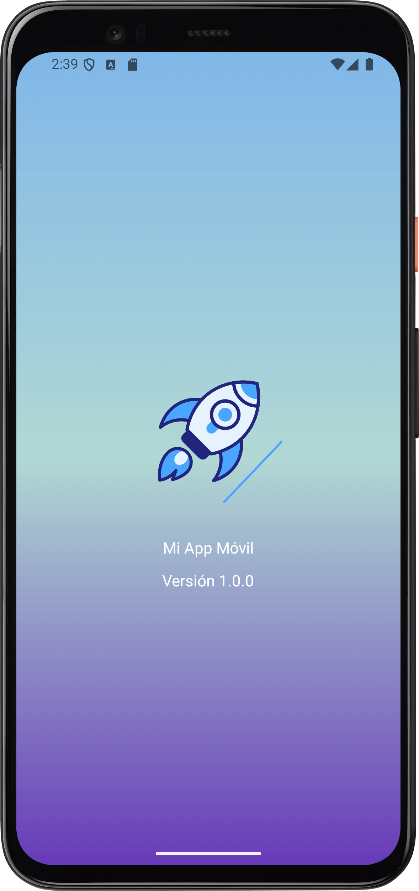
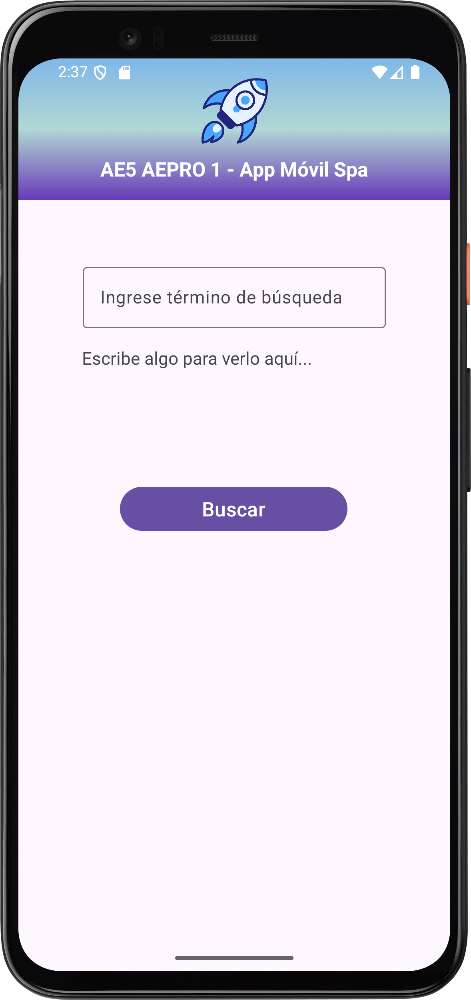
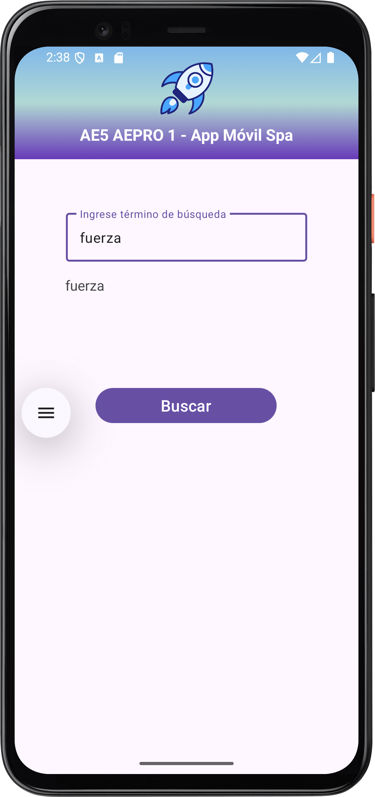
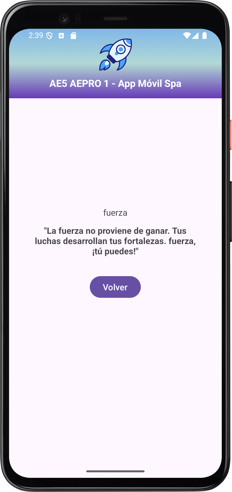

# AE5 - ABPRO1 Fragments y Navegación con  Safe Args

## **Resumen de la actividad AE5 - ABPRO1** **: App Movil SpA**
### **1. Objetivo del Proyecto**
Desarrollar una aplicación Android que demuestre el manejo profesional de la navegación entre fragments utilizando el Navigation Component y NavHostFragment, la captura y procesamiento de inputs del usuario, y la correcta implementación de listeners y buenas prácticas de programación, cumpliendo con los requerimientos de App Movil SpA.

-----
### **2. Tecnologías y Componentes Utilizados**
- **Entorno de Desarrollo:** Android Studio.
- **Lenguaje de Programación:** Java.
- **Arquitectura de Navegación:**
    - NavHostFragment: Implementado en la MainActivity como contenedor principal para gestionar la navegación entre fragments. Es el corazón del Navigation Component.
    - Archivo de Navegación: nav\_graph.xml configurado para definir los fragments (principalFragment y resultadosFragment) y la acción de navegación entre ellos.
    - Safe Args: Plugin de Gradle utilizado para generar clases de tipo seguro que permiten pasar argumentos entre fragments sin necesidad de usar Bundle manualmente. Esto garantiza la seguridad de tipos en tiempo de compilación.
- **Manejo de Vistas:**
    - View Binding implementado en ambos fragments y en la actividad principal para acceder a los elementos de la UI de forma segura y eficiente.
    - Limpieza del binding en onDestroyView() para prevenir NullPointerException.
- **Interacción con el Usuario:**
    - EditText en Fragment A para capturar el término de búsqueda ingresado por el usuario.
    - Button en Fragment A con OnClickListener para disparar la navegación.
    - TextWatcher en el EditText para mostrar en tiempo real el texto ingresado en un TextView de preview.
    - **Paso de Datos con Safe Args:** El texto ingresado se pasa de PrincipalFragment a ResultadosFragment mediante la clase generada PrincipalFragmentDirections.ActionPrincipalFragmentToResultadosFragment.
    - **Recepción de Datos con Safe Args**: En ResultadosFragment, el dato se recibe mediante la clase generada ResultadosFragmentArgs, asegurando que el tipo de dato sea correcto.
- **Gestión de Datos desde JSON:**
    - **Clase Modelo FraseMotivacional:** Clase Java que representa la estructura de cada frase en el archivo JSON, con atributos palabra\_clave y frase.
    - **Clase Utilitaria JsonLoader:** Clase encargada de leer el archivo frases.json almacenado en la carpeta res/raw/, parsearlo y convertirlo en una lista de objetos FraseMotivacional.
    - **Búsqueda Inteligente:** En ResultadosFragment, la app busca en la lista cargada una frase cuya palabra\_clave coincida (ignorando mayúsculas) con el texto ingresado por el usuario. Si encuentra coincidencia, personaliza la frase reemplazando un marcador [INPUT] con el texto del usuario. Si no encuentra coincidencia, muestra un mensaje genérico.
- **Splash Screen con Lottie (Fines Educativos):**
    - Se implementó una activity SplashScreen que se lanza al iniciar la app.
    - Se utilizó la librería Lottie para cargar y reproducir una animación vectorial en formato JSON (startup.json) almacenada en la carpeta assets/.
    - La actividad muestra la animación durante 3 segundos y luego inicia la MainActivity mediante un Intent.
    - Este componente fue incluido exclusivamente para aprender y explorar el funcionamiento e implementación de animaciones Lottie en Android, enriqueciendo la experiencia de usuario inicial.
-----
### **3. Descripción de la Funcionalidad**
1. **Pantalla Inicial (Fragment A - PrincipalFragment):**
    1. El usuario ingresa un texto (por ejemplo, una palabra clave como "éxito" o "fuerza") en un campo de texto.
    2. Mientras escribe, el texto se muestra en tiempo real en un TextView debajo del campo, gracias al TextWatcher.
    3. Al presionar el botón "Buscar", la app valida que el campo no esté vacío.
    4. Si la validación es exitosa, la app navega al Fragment B, pasando el texto ingresado como argumento.
2. **Pantalla de Resultados (Fragment B - ResultadosFragment):**
    1. Recibe el texto enviado desde el Fragment A.
    2. Muestra el texto recibido en un TextView, formando parte de un mensaje motivacional (por ejemplo: "¡Frase motivacional para: [texto del usuario]!").
-----
### **4. Buenas Prácticas Implementadas**
- **Prevención de NullPointerException:** Se limpia la referencia del binding en el método onDestroyView() de ambos fragments, liberando recursos y evitando fugas de memoria.
- **Validación de Entrada**: Se verifica que el campo de texto no esté vacío antes de navegar, mejorando la experiencia de usuario.
- **Código Limpio y Mantenible:** Se utilizó View Binding en lugar de findViewById, lo que hace el código más legible y menos propenso a errores.
-----
### **5. Explicación de la Clase R**
La clase R (Resources) es generada automáticamente por el sistema de compilación de Android durante el proceso de build. Actúa como un puente entre el código Java/Kotlin y los recursos definidos en XML (layouts, strings, drawables, ids, etc.).

- **Funcionamiento**: Cada recurso en la carpeta res/ (como activity\_main.xml, strings.xml, o nav\_graph.xml) es asignado a un ID entero único en la clase R. Por ejemplo, R.id.buttonBuscar o R.layout.fragment\_principal.
- **Relación con el Pipeline:** Durante la compilación, el plugin de Android convierte todos los recursos en un archivo binario (resources.arsc) y genera la clase R.java con las constantes correspondientes. Esto permite que el código acceda a los recursos de forma eficiente en tiempo de ejecución.
- **Importancia**: Sin la clase R, no sería posible referenciar recursos desde el código. Es fundamental para la integración entre la lógica de la app y su interfaz de usuario.

### **6. Capturas de Pantalla**

  
  
  

  
  

